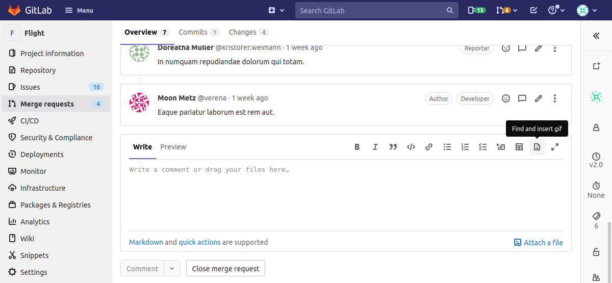
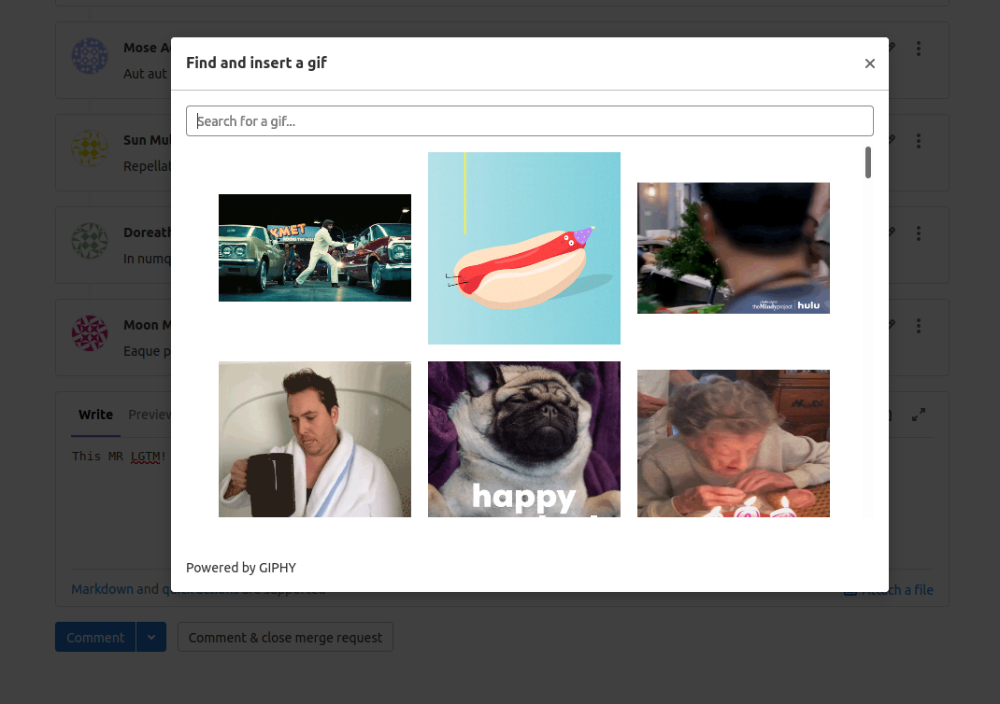
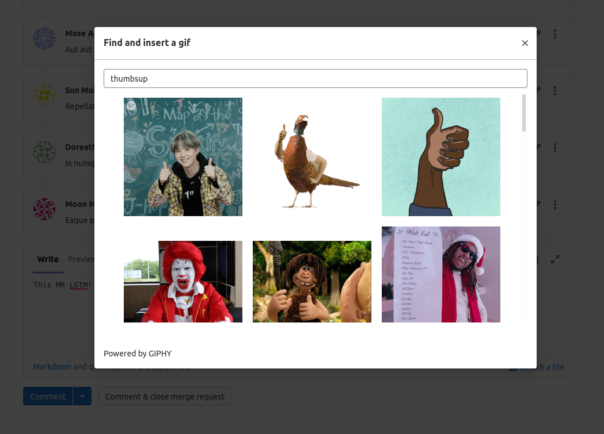
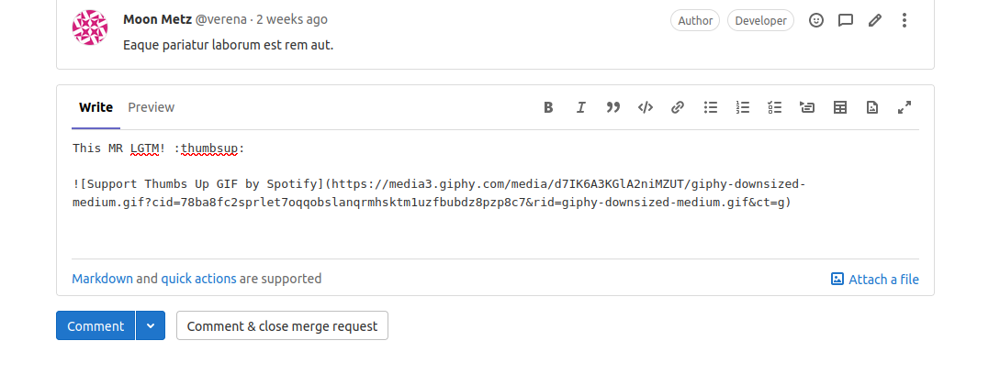

# Project Giphy - Requirements

The requirements for this project are:

1. [Make the 'Find and insert GIF' button visible](#make-the-find-and-insert-gif-button-visible).
1. [Show the 'Find and insert GIF' modal](#show-the-find-and-insert-gif-modal).
1. [Search for GIFs](#search-for-gifs).
1. [Insert the GIF](#insert-the-gif).

## 1. Make the 'Find and insert GIF' button visible

Given that a user is signed in,  
When a user is in a textarea to write a comment,  
Then the user should see a button for **Find and insert GIF** in the comment editor toolbar.

**Details:**

1. Use the [`doc-image`](http://gitlab-org.gitlab.io/gitlab-svgs/?q=~doc-image) SVG for the icon.

> **Hint:**  
> Review [`vue_shared/components/markdown/header.vue`](https://gitlab.com/gitlab-org/gitlab/blob/4bf3cc6e0ab8ae26ab00f1d753d14b3625e7e200/app/assets/javascripts/vue_shared/components/markdown/header.vue#L168) for where the existing toolbar buttons live.

## 2. Show the 'Find and insert GIF' modal

Given that a user is signed in and writing a comment,  
When the user clicks the **Find and insert GIF** button,  
Then open a modal with an empty search bar, and a list of trending GIFs.

**Details:**

1. Paginate responses from Giphy. Request only 25 at a time.
1. When the user scrolls to the bottom of the result, fetch the next page. Review the
  `@gitlab/ui` [`GlInfiniteScroll` component](https://gitlab-org.gitlab.io/gitlab-ui/?path=/story/base-infinite-scroll--default).
1. Align Giphy results neatly, with even spacing. Consider using
   [flexbox](https://developer.mozilla.org/en-US/docs/Web/CSS/CSS_Flexible_Box_Layout/Basic_Concepts_of_Flexbox).
1. Use the `downsized_medium` version of the Giphy image for rendering.
   [An API reference](https://developers.giphy.com/docs/api/schema#image-object)) is available.

> **Hints:**
> 
> - The click behavior of most toolbar buttons in
>   [`header.vue`](https://gitlab.com/gitlab-org/gitlab/blob/4bf3cc6e0ab8ae26ab00f1d753d14b3625e7e200/app/assets/javascripts/vue_shared/components/markdown/header.vue#L168) is automatic, and depends on the `tag` property set. This **does not** work
>   in our case, because we don't yet know what text to insert. Consider setting
>   an arbitrarily empty `tag` property, and handle custom behavior in a `@click` handler.
> - Review the
    [`handleQuote`](https://gitlab.com/pslaughter/gitlab-ase-snapshot/-/blob/f7631331fc56ec71e9e5f3afadaeb35ceeb8627f/app/assets/javascripts/vue_shared/components/markdown/header.vue#L125)
    method for an example of a button that deviates from the default behavior. Consider a
    `handleGif` method which calls
    [`CopyAsGFM.insertPastedText`](https://gitlab.com/gitlab-org/gitlab/blob/a5fcd806ff4e6e7510f9981c5d8eacab571a64d7/app/assets/javascripts/behaviors/markdown/copy_as_gfm.js#L82)
    (or even just [`insertText`](https://gitlab.com/gitlab-org/gitlab/blob/e9e8f919fd78ac87770af4251dde6919f179cded/app/assets/javascripts/lib/utils/common_utils.js#L297)
    directly) after the user clicks an image.

## 3. Search for GIFs

Given that a user is using the comment editor,  
And the user clicked the **Find and insert GIF** button,  
And the **Find and insert GIF** modal opened,  
When the user enters text in the modal's search bar,  
Then the list of GIFs should be refreshed from Giphy using the search value.

**Details:**

1. Include a 250ms [debounce](https://css-tricks.com/debouncing-throttling-explained-examples/)
   between the user input and the network request.
1. If the search is cleared, fetch the trending GIFs with Giphy's
   [trending endpoint](https://developers.giphy.com/docs/api/endpoint#trending).

> **Hint:**  
> Use [lodash's `debouce`](https://lodash.com/docs/4.17.15#debounce) method.

## 4. Insert the GIF

Given that a user is using the comment editor  
When the user clicks the **Find and insert GIF** button,  
And the user clicks on a GIF  
Then the modal should close  
And Markdown for the selected image should be inserted in the last caret position of the textarea.

**Details:**

1. The newly-inserted Markdown should follow the
   [syntax for images](https://www.markdownguide.org/basic-syntax/#images-1). For example:
   ``.
1. If the user had selected a block of text before selecting **Find and insert GIF**,
   the Markdown should **replace** the selected text.

> **Hint:**  
> If the user selects a block of text in the textarea, opening the Giphy modal can
> clear out this selection data. Consider saving the
> [`selectionStart` and `selectionEnd` of the textarea](https://developer.mozilla.org/en-US/docs/Web/API/HTMLTextAreaElement)
> before opening the modal, so you can restore this state before inserting the new Markdown.

## References

- [Upstream issue](https://gitlab.com/gitlab-org/gitlab/-/issues/17379)
- [Giphy API documentation](https://developers.giphy.com/docs/api#quick-start-guide)
- [GitLab Flavored Markdown reference](https://docs.gitlab.com/ee/user/markdown.html)